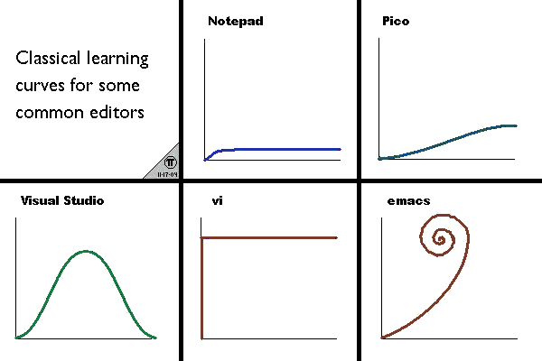

# VIM: Usage, and Beyond

> The material in this reference is specifically written and tested for use on
> Mac OS X from a command line environment, however nearly all of the material
> should be fine on Linux. Most of the material should also be fine for
> graphical VIM environments (MacVim, GVim). Your mileage may vary for use on
> Windows. Additionally this guide isn't designed to be a comprehensive
> reference to VIM usage, the
> [official VIM > documentation](http://www.vim.org/docs.php) already exists
> for that. Rather this guide is intended to be a practical introduction to
> VIM, while also covering areas less commonly seen in VIM guides, such as
> customization.

## Quick Start

This section will provide the required information for users that want to get
started using VIM immediately however I strongly recommend reading through the
rest of this document at some point.

To open a document for editing, run

```
$ vim <filename>
```

Press `i` to enter Insert mode. Use the arrow keys to navigate the cursor to
the desires position and type as normal.

To save, press <escape>, type `:w`, and press <enter>. To begin editing again,
follow the instruction point above.

To exit VIM, press <escape>, type `:q`, and press <enter>. If you want to save
and quit, instead type ":wq" and press <enter>.

## Overview

VIM, not undeservingly, has gained a reputation for being impossible to use, or
at least having a very steep learning curve. This is due to the need to
memorize many arcane, unintuitive commands and modes just for a purpose as
basic as typing characters into a file.

This comic from the Internet does a good job of illustrating learning VIM
vs other, more beginner friendly editors like Notepad and Pico.



*Image taken from http://unix.stackexchange.com/questions/986*


### What is VIM?

VIM is a text editor, used for creating and editing plain text files. VIM is
commonly used for writing computer programs but is more than capable of
creating any sort of plain text document, like a "README.txt" file for example.
VIM is also incredibly versatile and is available and fully functional in both
graphical and text terminal based environments, lending itself to be used on
both desktop and server operating systems.

### What isn't VIM?

VIM is not a rich text editor. VIM is not designed for the type of text editing
Microsoft Word is usually associated with and does not support text styling
such as bold, italics, or underline.

## Usage

### Modes

VIM has four main modes that you switch between while using it.

- Normal mode: This is the mode VIM you in by default, and is where you can run
editor commands. Commands are mainly used for navigation around the document,
searching, and deleting/cut-and-paste'ing.
- Insert mode: This is the standard mode for actually writing text into the file.
You enter this mode by running the editor command `i` while in normal mode.
- Visual mode: This mode lets you select large blocks of text and perform
operations on them. This emulates the click and drag behavior of graphical
interfaces if you are using VIM in a text terminal. You enter this mode by
running the editor command `v` while in normal mode.
- Command Line mode: This mode lets you enter in VIM commands, distinct from the
above editor commands, that enable more advanced functionality such as
searching and replacing in the document, and configuring VIM settings. You
enter this mode by typing `:` while in normal mode.

### Basic Introduction

> All commands referenced in this section refer to Normal mode commands.

#### Opening, Saving, Closing

To open a file in VIM, at a command line shell, type `vim <filename>` and press
enter. To save, run the command line command, `w`. To quit, run the command
line command `q`. These command line commands can be chained together; for
example, to save and quit, run `wq` in command line mode.

#### Navigation

Basic navigation in VIM is accomplished by using the `hjkl` keys, corresponding
to the "left", "down", "up", and "right" directions respectively. Arrow keys
also work, but use of them is discouraged since it is much faster to use `hjkl`
and keep your fingers on the home keyboard row. To move more quickly around in
VIM, the `w`, `e`, and `b` keys can also be used. `w` moves to the beginning of
the next word, `e` moves to the end of the next word, and `b` moves to the
beginning of the previous word. At any point, to reset VIM and clear any
commands that may have been entered, hit `<escape>`. To jump up and down half of
a window for page-up and page-down behavior, use `Ctrl-d` and `Ctrl-u`. To search
through the document, press `/`, type what you are searching for, and press
`<enter>`. This will search from the current cursor position. Press `n` to
proceed forward through the results, or `N` to go backwards.

#### Editing

Once you've navigated the cursor to a location where you would like to insert
text, press the `i` key to enter Insert mode. Now you can type as normal, using
characters keys, arrows and backspace/delete. To exit back into Insert mode,
press `<escape>`.

In Normal mode `x` and `X` can be used to delete the character currently under
the cursor, and the character before the cursor, respectively. The `d` can also
be paired with an navigational command to delete words or lines at a time. For
example, pressing `de` will delete every character until the end of the current
word. `dd` is a particularly useful command which deletes the entire line the
cursor is on.

Something that may be confusing to new VIM users is that there is no
distinction between deleting and cutting (referring to cut and paste). That is,
when any set of characters is deleted, it is automatically saved in buffer
space to be pasted when `p`, the paste command, is pressed. To copy characters,
rather than deleting them, the `y` key is used in the same fashion as the `d`
key. For example, pressing `ye` copies all characters until the end of the
current word. `yy` is also useful, and copies the current line.

For more detail on any command, in Normal mode type `:help <command>` where
`<command>` is the command you need help with, and press enter. This will bring
up VIM's extensive documentation on that command or functionality.

## Customization

VIM is highly configurable and the average user will likely modify VIM's
behavior to their own preferences after beginning to use VIM. This can be done
within a VIM session using the `set` command line mode command, for example,
running `set number` in command line mode enables line numbers along the left
of the window. Configurations done with the `set` command will only last for
the lifetime of the VIM session (until VIM is quit). Persistent configurations
that apply to all VIM sessions go in a file named `.vimrc` which must be
located in the user's home directory on the system (usually referred to as
`~`). This file simply contains command line mode commands that vim will
run when it starts. VIM additionally also has a directory called `.vim`, 
also within the user's home directory that is used for storing things like
plugins.

Common Customizations

- `syntax enable`: activates programming language syntax highlighting
- `number`: activates line numbers
- `nowrap`: suppresses default line wrapping when a line gets longer than the
   window
- `mouse=a`: activates mouse usage in text terminals
- `hlsearch`: highlight search terms
- `ignorecase`: ignore letter case when searching

An sample `.vimrc` could look like this:

```
syntax enable
set nocompatible
set number
set splitbelow
set splitright
set ruler
set foldmethod=indent
set foldlevel=99
set nowrap
set colorcolumn=80
highlight ColorColumn ctermbg=7 " light grey color column
set noswapfile
set tabstop=4 shiftwidth=4 softtabstop=4 autoindent expandtab
set hlsearch incsearch ignorecase smartcase

```

### Plugins

Plugins are computer programs written in a language called Vimscript which
further extend VIM's functionality. Many of them are available from the
official [VIM plugin repository](http://www.vim.org/scripts/), however there are
also many available from websites like Github, which let users upload code
and other plain text files.. Simple VIM plugins comes in
the form of a simple .vim file which can be placed in `~/.vim/plugins`. For more
complex plugins, each file of the plugin needs to be placed the proper
directory. 

#### Plugin Managers

Managing plugins manually can quickly become very complex, which is why most
users will find using a plugin manager to be much easier. I'll talk about two
of the most popular ones.

##### Pathogen

[Pathogen](https://github.com/tpope/vim-pathogen) was the first popular VIM plugin manager and simplifies plugin
installation to be as easy to downloading them into the `~/.vim/bundle`
directory.

##### Vundle

[Vundle](https://github.com/gmarik/Vundle.vim) is a newer VIM plugin manager
and is popular its direct integration with
Github and similarity to a package manager, like `apt` on Ubuntu Linux, for
example. With Vundle, URLs to plugins available from the internet, or local
file paths to plugins are specified in your `.vimrc` and then easily
installed/removed/updated via command line commands like `BundleInstall`.

The Vundle section of a `.vimrc` is below. The text in between quotes is the
part of a Github URL, following the `http://github.com/`.

```
" Vim plugins
Bundle 'scrooloose/nerdtree'
Bundle 'scrooloose/syntastic'
Bundle 'tpope/vim-commentary'
Bundle 'ervandew/supertab'
Bundle 'tomtom/tlib_vim'
Bundle 'MarcWeber/vim-addon-mw-utils'
Bundle 'garbas/vim-snipmate'
Bundle 'honza/vim-snippets'
Bundle 'majutsushi/tagbar'
Bundle 'dag/vim-fish'
Bundle 'bling/vim-airline'
Bundle 'sjl/gundo.vim'
Bundle 'kien/ctrlp.vim'
```

Using Vundle looks like:


### Common/Recommended Plugins

- [NerdTree](https://github.com/scrooloose/nerdtree): Creates a file browser within VIM which makes it much easier to
  navigate a project with multiple files
- [Syntastic](https://github.com/scrooloose/syntastic): Programming language syntax checking
- [Snipmate](https://github.com/garbas/vim-snipmate): Easily insert certain textual snippets, useful for progammers
- [Commentary](https://github.com/tpope/vim-commentary): Easily comment out code

## Further Reading

- [Official Vim Documentation](www.vim.org/docs.php)
- [Vim Tips Wiki](http://vim.wikia.com/wiki/Vim_Tips_Wiki)
- [Thoughtbot Vim Guides](http://robots.thoughtbot.com/tags/vim)
- [Vim Awesome](http://vimawesome.com/)

